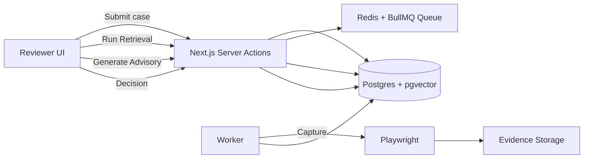

# BeaconGate

Evidence-first ads review queue. Reviewers submit cases (ad copy, category, landing URL); the system captures evidence, runs policy rules, and surfaces RAG-backed policy/precedent plus an optional non-binding LLM advisory. Decisions are recorded and case files generated for audit.

## What it does

- **Evidence capture** — Screenshot, HTML snapshot, redirect chain, and network summary stored with hashes. Capture runs in a worker via Playwright; SSRF guards block localhost and private IPs.
- **Deterministic rules + risk queue** — Policy-as-code rules (prohibited phrases, missing health disclaimers, domain denylist, redirect/heuristic checks) run on submit. Risk score and tier drive queue ordering.
- **RAG policy/precedent retrieval** — Vector search over ingested policy docs and precedent cases. Local embeddings (Xenova/all-MiniLM-L6-v2); no API key required. Results are advisory only.
- **Non-binding LLM advisory** — Optional structured advisory (claims, evasion signals, policy concerns with chunk citations). Mock provider by default; OpenAI optional. Schema-validated; citations checked against retrieval.
- **Audit-ready case files** — Each decision produces a versioned case file (JSON) including decision, evidence refs, rule hits, retrieval run id, and pinned LLM run id when applicable.

## Architecture



## Setup

1. **Copy env and start Postgres + Redis** (required; otherwise you’ll see `DATABASE_URL` / `ECONNREFUSED` errors):

```bash
cp .env.example .env
docker-compose up -d
```

2. **Install, migrate, and seed:**

```bash
npm install
npx prisma generate
npx prisma migrate dev
npm run db:seed
npm run rag:ingest
```

Run the app and worker (separate terminals):

```bash
npm run dev
npm run worker
```

Open http://localhost:3000.

## Tests

- **Unit + integration** — Vitest. No network; mock provider only.
- **E2E** — Playwright against local Next + worker. Test fixtures under `/test-pages` (landing with hidden text, redirect chain, final page).

```bash
npm run test:unit      # Vitest
npm run test:watch     # Vitest watch
npm run test:e2e       # Playwright (dev + worker must be running)
npm run test           # unit then e2e
```

E2E capture tests use local URLs only (e.g. `baseURL/test-pages/final`). Set `LLM_PROVIDER_FORCE=mock` when running E2E to avoid OpenAI.

## Tech

Next.js (App Router), TypeScript, Tailwind, Prisma, Postgres (pgvector), Redis, BullMQ, Playwright (capture). Local embeddings via Xenova/transformers. Optional OpenAI for advisory.

## Security notes

- SSRF guardrails block localhost and private IP ranges for evidence capture.
- Evidence artifacts are served via a controlled API route (no raw filesystem paths exposed).
- Policy rules are deterministic; LLM output is advisory-only and labeled “non-binding”.
- No automated enforcement decisions; reviewer action is required.
